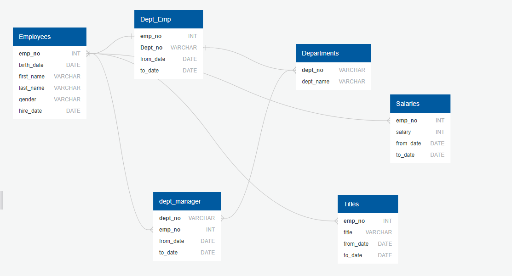
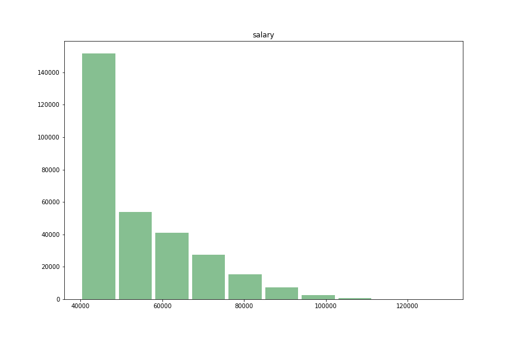
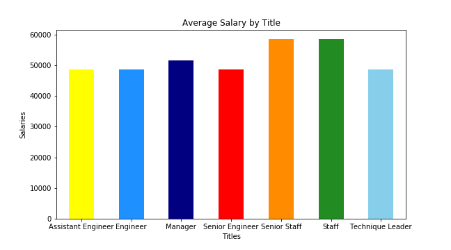

# sql Project

In this project I designed tables to hold data from CSV files, imported the CSVs into a SQL database, and answer questions about the data. The data utilized was from a research project on employees of a corporation from the 1980s and 1990s. 

The process completed is as follows: 

## Data Modeling
Inspected the CSVs and sketched out an ERD of the tables. 

## Data Engineering
Created a table schema for each of the six CSV files.

## Data Analysis:
*Please note the queries are available for review under the SQL Queries Folder*

After the database was completed I was able to answer the following question:

Listed the following details of each employee: employee number, last name, first name, gender, and salary.

List employees who were hired in 1986.

Listed the manager of each department with the following information: department number, department name, the manager's employee number, last name, first name, and start and end employment dates.

Listed the department of each employee with the following information: employee number, last name, first name, and department name.

Listed all employees whose first name is "Hercules" and last names begin with "B."

Listed all employees in the Sales department, including their employee number, last name, first name, and department name.

Listed all employees in the Sales and Development departments, including their employee number, last name, first name, and department name.

In descending order, list the frequency count of employee last names, i.e., how many employees share each last name.

## Bonus

Created a histogram to visualize the most common salary ranges for employees.

Created a bar chart of average salary by title.

